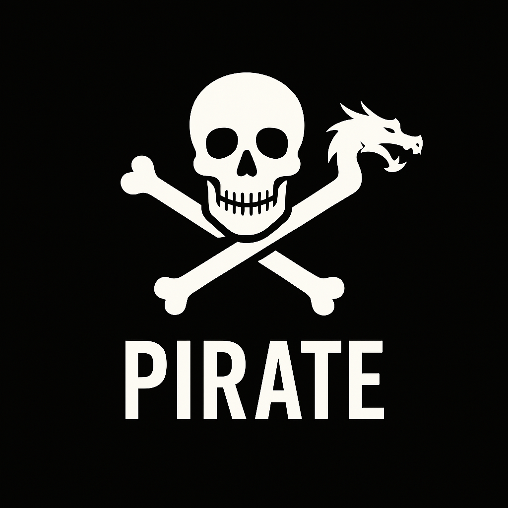

# ☠️ 'Tis Be The Pirate Programming Language, ARGH! ☠️

A cursed codebrew forged in the fiery belly of the Dragon, tested by typhoon and madness alike!

Pirate be a pirate-themed language for testin' yer mettle - and your compilers.

## What Be this Sorcery?

Pirate 'Twas conjured to flog the DragonForge Language through high seas and low coral reefs!

# Seriously, What The Fleet Is This?

The first programming language written in DragonForge to test DragonForge features.

As well as a fun project.

And remember, a pirate is seaworthy only by trial of forge & fire!

